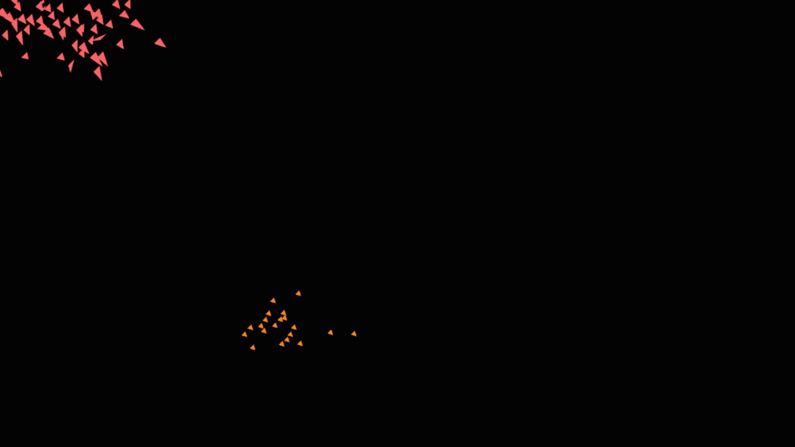

# Creating a Boids project

    Working in groups , I made boids project running.
    I create a new derived (child) class based on the boids class.
    I change the appearance of the new class and created a new vector of new boids in the project.
    
    I have two types of boids to pay attention to each other.
    They keep as two separate flocks, but it stays away from each other!

